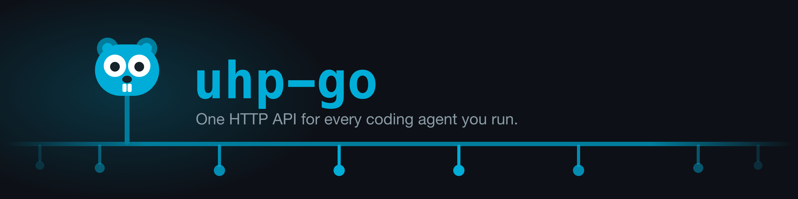

<p align="center">
  
</p>

# uhp-go

[](https://github.com/aenawi/uhp-go/actions/workflows/ci.yml)
[](https://github.com/aenawi/uhp-go/actions/workflows/security.yml)
[](https://go.dev/doc/devel/release)
[](LICENSE)

One HTTP API for every coding agent you run.

Every product that embeds a coding agent ends up writing the same things: start a task,
follow its progress, continue the conversation, cancel it, collect the files it wrote, work
out why it failed. Then you add a second harness and write all of it again.

`uhp-go` answers those questions once, behind a single HTTP surface, so you can swap or add
harnesses without touching client code. It implements the
[Unified Harness Protocol](https://unifiedharnessprotocol.org), an open specification modelled
on the OpenAI Responses API.

**Conformance: `full` 63/63, zero skipped** — every check in the published suite, at the
revision named in [docs/conformance.md](docs/conformance.md). Eight of those checks exist
because this repository reported the gap: Sessions §5 was a `full` requirement the suite
never touched, which made a green `full` run silent about the feature that defines the class.
The suite is the authority and anyone can run it against this server; that page has the
command, the reproduction steps, the run that failed before the last fix landed, and an
honest list of what a green run still cannot see.

## Try it

```bash
go build -o bin/uhpd ./cmd/uhpd
UHP_API_KEYS=devkey ./bin/uhpd
```

```bash
curl -s http://localhost:8080/v1/responses \
  -H "Authorization: Bearer devkey" -H "Content-Type: application/json" \
  -d '{"input":"Summarise README.md in three bullets.",
       "metadata":{"harness_id":"claude-code"}}'
```

Add `"stream": true` and you get Server-Sent Events instead of one JSON object. Set
`previous_response_id` to a task's id to continue that conversation.

There is also a CLI:

```bash
go install github.com/aenawi/uhp-go/cmd/uhpc@latest

export UHP_BASE_URL=http://localhost:8080 UHP_API_KEY=devkey
uhpc discover                              # what this server can do
uhpc harnesses                             # what it can run, and what's ready
uhpc run --stream "summarise the README"   # a task, rendered as it arrives
```

`uhpc` works against any conformant UHP server, not just this one.

Each harness shells out to an agent CLI, so whichever ones you configure need to be
installed and logged in on the machine running `uhpd`. The bases shipped today are
`claude-code`, `codex`, `grok-cli`, `opencode` and `pi`; adding another is a file and a
line, not a fork — see [Harnesses](docs/harnesses.md).

## It runs entirely offline

`uhpd` never calls home. No telemetry, no licence check, no account, no hosted dependency.
The only processes it talks to are the harness CLIs you installed, over stdin and stdout.

There is no database to run either. It has two dependencies outside the standard library —
`github.com/google/uuid` and a pure-Go SQLite that compiles into the binary. Nothing to
host, nothing to install. What that second one costs is written up in
[ADR-0001](docs/adr/0001-sqlite-for-tasks-and-sessions.md).

That is a property of the protocol and not just of this implementation. The specification
says outright that "nothing in the wire format requires a hosted service, an account, a
licence key, or a call home."

One thing worth knowing early: `UHP_API_KEYS` is **inbound** authentication. It is the list
of bearer tokens *this* server accepts from *its* clients, and you invent the values. Nobody
issues them. Leave it unset and the server still runs, but only on loopback, and it logs a
warning telling you it is authenticating nothing — a server with no keys isn't conformant.
Widen the bind address without setting keys and it refuses to start.
See [Authentication](docs/authentication.md).

## Documentation

| | |
|---|---|
| [Talking to a UHP server](docs/client.md) | The CLI, the Go client, and importing the protocol's types |
| [The HTTP surface](docs/api.md) | Every endpoint, which request fields are read, reconnecting, idempotency |
| [Running it](docs/operations.md) | Configuration, storage, concurrency, task and step budgets, the Docker image |
| [Authentication](docs/authentication.md) | Bearer keys, the loopback default, and why several keys are still one tenant |
| [Harnesses](docs/harnesses.md) | Configuring one over HTTP, what reaches the agent, adding another |
| [Files](docs/files.md) | Files as task input, artifacts as output, download safety |
| [Session sharing](docs/session-sharing.md) | Read-only public links, and the consent switch in front of them |
| [Conformance](docs/conformance.md) | The score, how to reproduce it, and what a green suite still can't see |
| [Architecture](docs/architecture.md) | How the tree is laid out |
| [Testing](docs/testing.md) | What's free on every push, and what costs tokens |
| [Decisions](docs/adr/) | Architecture decision records — why things are the way they are |

## The harnesses shipped today

Nothing here is limited to this list — a harness is a data declaration and the router doesn't
care how many there are. These are the bases that ship configured, and every one of them
advertises `sessions`, `cancellation`, and files in and out. What differs between them is how
much each CLI can enforce natively rather than by being asked nicely in its prompt:

| Base | Tool block | Skills | Per-run MCP |
|---|---|---|---|
| `claude-code` | `--disallowedTools`, executed | standing instruction | `--mcp-config`, executed |
| `grok-cli` | `--disallowed-tools`, verified | standing instruction | none |
| `pi` | `--exclude-tools`, verified | `--skill`, verified | none |
| `codex` | standing instruction | standing instruction | none |
| `opencode` | standing instruction | standing instruction | none |

"Verified" means the flag was read from that CLI's own `--help` on a machine where it is
installed. "Executed" means it was actually run and watched from the far end. Where a
runtime can't hard-block a tool, the restriction still reaches the agent as an instruction
and is described to it as unenforced — never quietly dropped.

The full table, what each of those words is worth, and what to check before you add one of
your own, are all in [Harnesses](docs/harnesses.md).

## Relationship to UHP

The Unified Harness Protocol is an open specification, published under Apache-2.0 and led by
HarnessRouter, who also ship a reference implementation and a commercial hosted product.

**`uhp-go` is an independent implementation. It is not affiliated with, endorsed by, or
supported by HarnessRouter.** It aims to be conformant to the published specification.

If this implementation and the specification disagree, treat it as a bug here and please open
an issue. If the *specification* looks wrong or ambiguous, an issue here is still the right
place to start — we'll raise it upstream, and we have:
[#42](https://github.com/HarnessRouter/harnessrouter/issues/42) and
[#44](https://github.com/HarnessRouter/harnessrouter/issues/44) are both ours.

## Security

`uhpd` accepts bearer tokens, brokers credentials to agent CLIs and starts subprocesses,
so the tooling is set up to assume that any of those is where a mistake would land.

| | | |
|---|---|---|
| SAST | [`gosec`](https://github.com/securego/gosec) | no excluded rules |
| Secrets | [`gitleaks`](https://github.com/gitleaks/gitleaks) | the whole history, not the working tree |
| Dependencies | [`govulncheck`](https://pkg.go.dev/golang.org/x/vuln) | plus weekly Dependabot on modules and actions |
| Lint | [`golangci-lint`](https://golangci-lint.run) | thirteen linters, `gosec` among them |

Everything above runs in the [Security workflow](.github/workflows/security.yml) on every
pull request and again every Monday — on a schedule because `govulncheck`'s answer changes
when the Go team publishes an advisory, not when somebody pushes. The same checks run
locally, at the same pinned versions:

```bash
make tools            # gosec, govulncheck and golangci-lint, pinned in the Makefile
make security         # report everything, fail on nothing
make security-push    # what the pre-push hook and the workflow gate on
make security-strict  # gate on govulncheck too, before cutting a release
```

**What the badge claims, precisely.** Green means `gosec` found nothing and `gitleaks`
found no secret anywhere in this repository's history. It does not mean the standard
library this binary links against is free of known advisories: `govulncheck` reports those
and does not fail the build, because a stdlib advisory is fixed by upgrading the Go
toolchain rather than by changing anything here, and a gate no contributor can pass is a
gate that gets switched off. `GOVULNCHECK_STRICT=1` makes it gate anyway, and
`make security-strict` is the release-time version that always does.

`gosec` runs with no excluded rules, which is a deliberate difference from a config that
silences a noisy rule globally. Each finding this repository accepts carries an
`#nosec <rule> -- reason` at the line that accepts it, so a new subprocess or file read
that nobody has reasoned about still fails the build rather than inheriting somebody's
old exemption.

Found something? Please use private reporting rather than an issue — see
[SECURITY.md](SECURITY.md).

## Contributing

Work is tracked as [GitHub issues](https://github.com/aenawi/uhp-go/issues). They carry
triage labels described in [docs/agents/triage-labels.md](docs/agents/triage-labels.md):
`ready-for-agent` means the work is specified well enough to hand to an agent, and
`ready-for-human` means it needs a product decision first.

Before pushing:

```bash
make hooks    # once per clone: build, vet, fmt and tests run on every push
make tools    # optional: adds lint and the security scanners to that hook
make verify   # everything CI checks, in one command
```

The hook runs the linter and the security scanners only if they are installed, so
`make hooks` stays a single command rather than a shopping list. CI runs them either way.

Security issues go through private reporting instead — see [SECURITY.md](SECURITY.md).

## License

Apache-2.0. See [LICENSE](LICENSE).

UHP and "Unified Harness Protocol" are marks of HarnessRouter. This project describes itself
as an implementation of the protocol, which their governance permits on the basis that it
passes the conformance suite.
